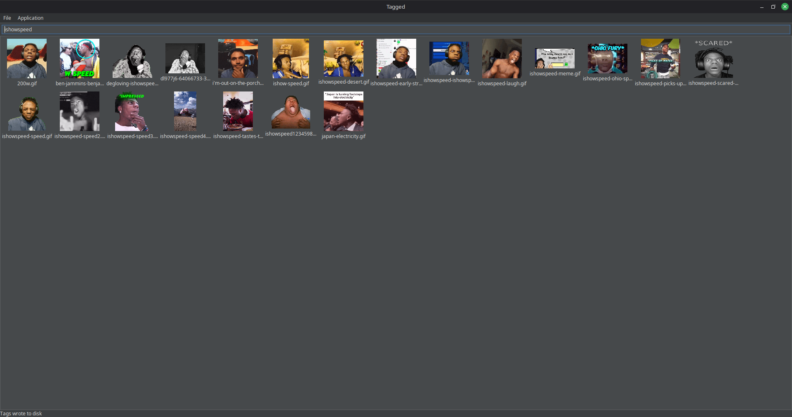

# Tagged

file tags searcher

this was initially built for searching and tagging
my reaction images lol

includes:
* file tagging
* "nice" Swing code
* Java-native GIF decoder...

## Building
Java 25 is required to build and run this app.

To make a JAR of this app: `gradlew jar`

To run this app within Gradle: `gradlew run`

To package this app for distribution: `gradlew assembleDist`

## Icon

The icon is inspired by [this meme](https://tenor.com/view/meme-who-are-you-tagging-gng-gif-7480716342697088315).
It looked AI generated, so I redrew it by hand. (i'm no artist </3)

## Cross-platform
Tag indices on one operating system may or may not work on the other (Windows ↔ Linux)

This is because of maybe file system differences and/or how the OS handles file paths.

I'm currently thinking of a solution to fix this for better cross-platform compatibility. ;-;